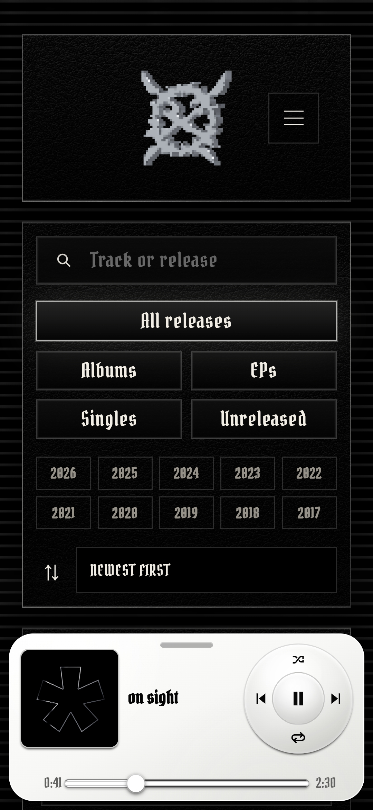
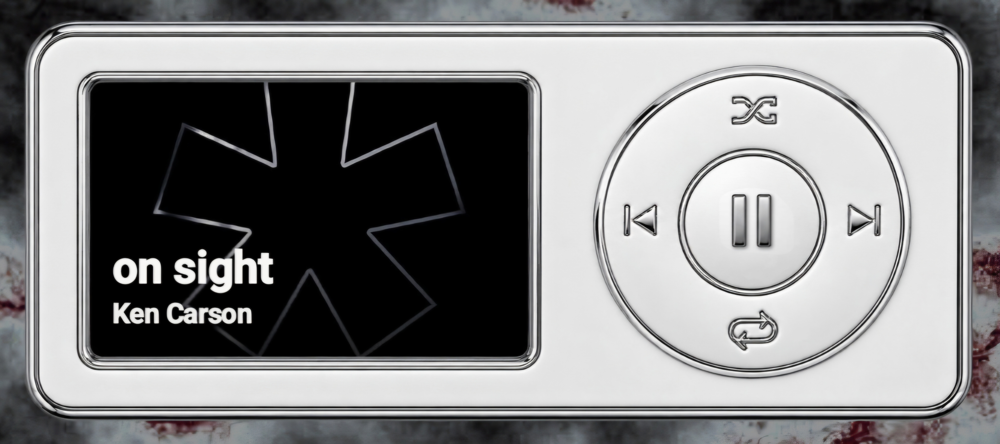

# MusicStation

MusicStation ist mein eigener Musikplayer für lokal gespeicherte Musik.

Ich habe das Projekt gemacht, weil ich ausprobieren wollte, wie eine eigene Anwendung zum Verwalten und Abspielen von Musik aufgebaut werden kann.

Releases, Cover und Audiodateien werden lokal auf dem jeweiligen Gerät gespeichert und nicht in eine zentrale Musikdatenbank hochgeladen.

<p align="center">
  
</p>

<p align="center">
  
</p>

## Funktionen

- eigene Releases mit Cover und Audiodateien hinzufügen
- lokale Musikbibliothek anzeigen
- Releases durchsuchen und filtern
- nach Album, EP, Single und unveröffentlichten Releases filtern
- Releases nach Jahr filtern
- Musik abspielen
- Playlists erstellen und verwalten
- als PWA installieren
- Teile der Anwendung offline verwenden

## Speicherung

MusicStation verwendet IndexedDB für die lokale Speicherung von Releases, Covern und Audiodateien.

Es gibt keine zentrale Musikdatenbank und keine Synchronisation zwischen verschiedenen Geräten.

Die hinzugefügte Musik bleibt auf dem jeweiligen Gerät beziehungsweise im verwendeten Browser oder in der installierten Anwendung.

## Technik

- Next.js
- React
- JavaScript
- TypeScript
- IndexedDB
- Browser Audio APIs
- Web App Manifest
- Service Worker

## Lokal starten

```bash
npm install
npm run dev
```

Projekt prüfen:

```bash
npm run lint
npm run build
```
